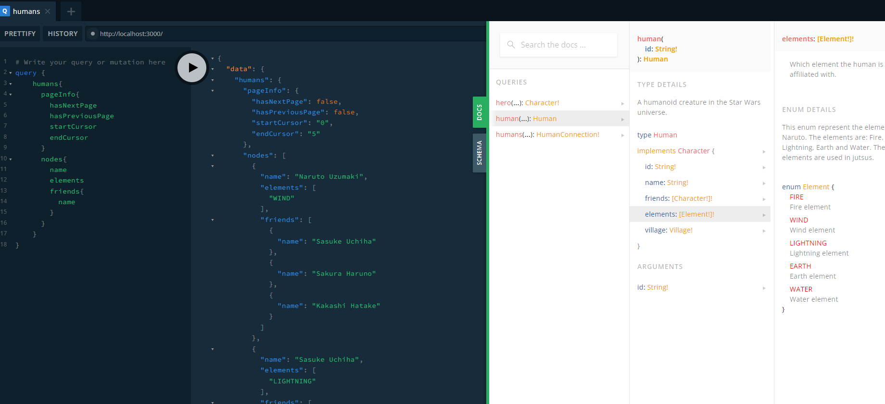

# Ara

This is a simple project for undestanding how works poem using `Async-graphql` and `tokio` to create a GraphQL server.

"Async-graphql is a GraphQL server-side library implemented in Rust. It is fully compatible with the GraphQL specification and most of its extensions, and offers type safety and high performance.

You can define a Schema in Rust and procedural macros will automatically generate code for a GraphQL query. This library does not extend Rust's syntax, which means that Rustfmt can be used normally. I value this highly and it is one of the reasons why I developed Async-graphql." - [Async-graphql](https://async-graphql.github.io/async-graphql/en/)

## How to run

```bash
cargo run
```

## Dependencies

- poem = "1.3.58"
- tokio = { features = ["rt-multi-thread", "macros"] }
- async-graphql = "5.0.10"
- slab = "0.4.4"
- tracing-subscriber = "0.3.17"

## Example

### Query

```graphql
query {
  humans {
    pageInfo {
      hasNextPage
      hasPreviousPage
      startCursor
      endCursor
    }
    nodes {
      name
      elements
      friends {
        name
      }
    }
  }
}
```

### Result



## Documentation

- [Poem](https://poem.rs/)
- [Async-graphql](https://async-graphql.github.io/async-graphql/en/)
- [GraphQL](https://graphql.org/)
